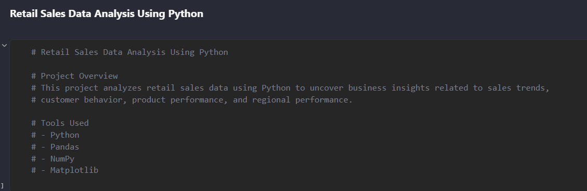
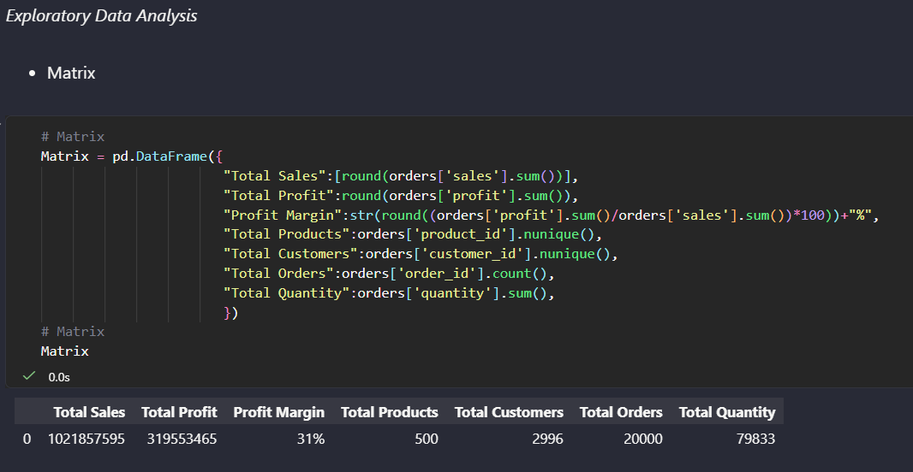
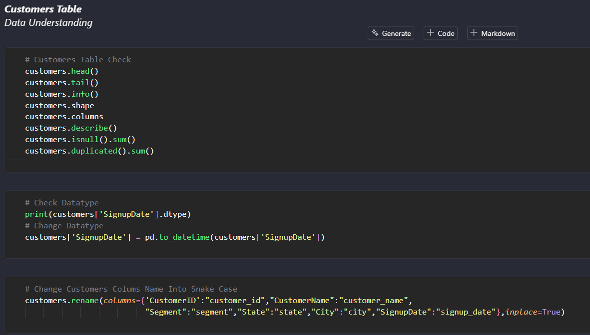
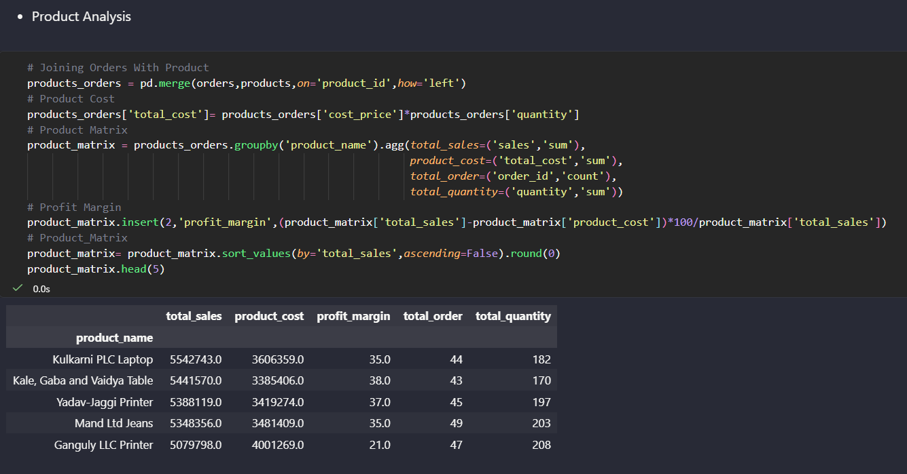
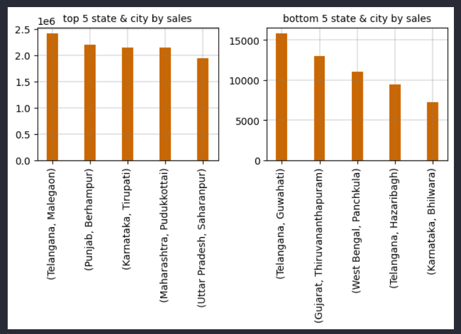
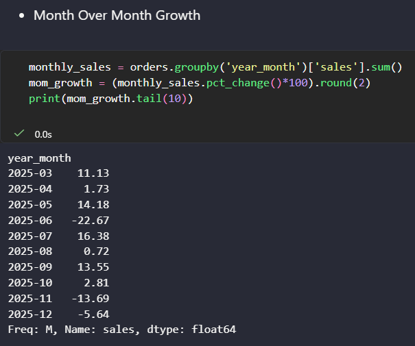
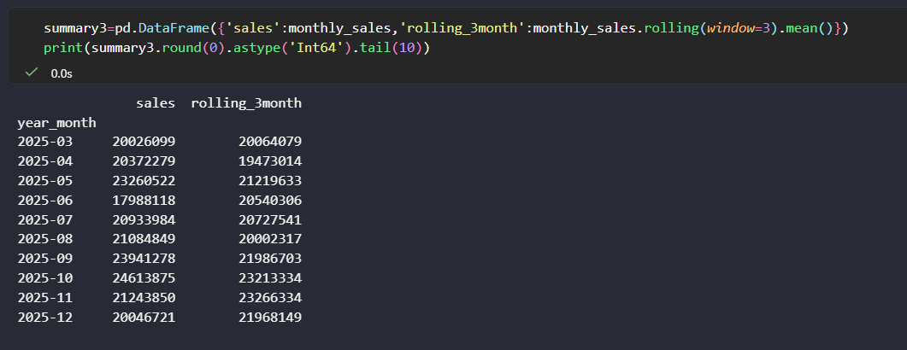

# Retail Sales Data Analysis using Python

## Project Overview

This project focuses on exploratory data analysis and business analytics using Python.

The analysis was performed on retail sales data to identify:
- sales trends
- customer behavior
- product performance
- KPI metrics
- business insights

---

# Tools & Libraries Used

- Python
- Pandas
- NumPy
- Matplotlib
- Jupyter Notebook

---

# Project Workflow

1. Data Loading
2. Data Cleaning
3. Data Transformation
4. Exploratory Data Analysis
5. KPI Analysis
6. Customer Analytics
7. Product Analytics
8. Trend Analysis
9. Rolling Average Analysis

---

# Business Questions Solved

- Which product categories generate highest sales?
- Which states contribute most revenue?
- Which customer segments perform best?
- What are the monthly sales trends?
- How do KPIs change over time?

---

# Skills Demonstrated

- Data Cleaning
- Exploratory Data Analysis
- Business Analytics
- KPI Reporting
- Trend Analysis

---

# Project Objective

---

# KPI Matrix

---

# Customer Understanding

---

# Product Analysis

---

# Product Analysis

# Month-over-Month Growth

---

# Rolling Average Analysis

